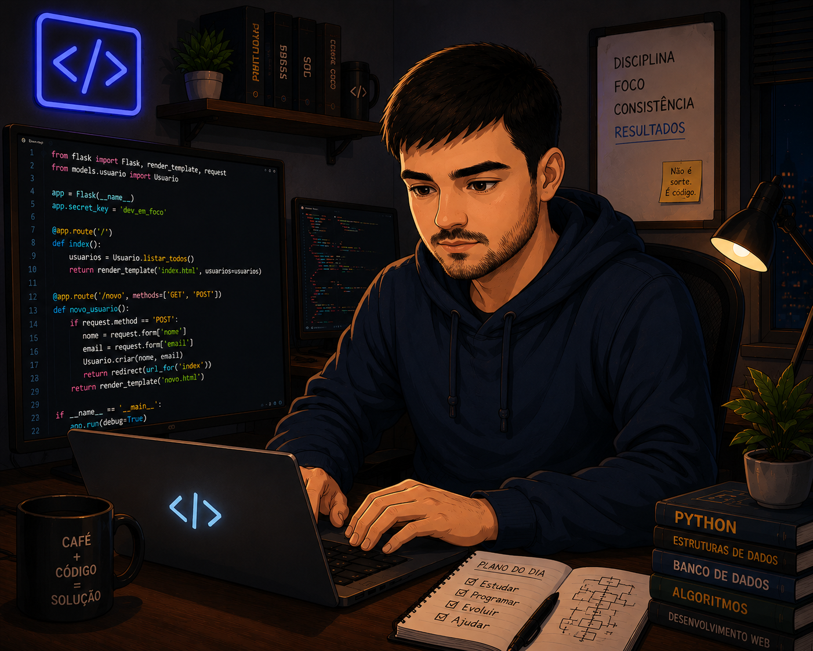

  

# Olá! Eu sou o Luiz Felipe 👋

Estudante de Análise e Desenvolvimento de Sistemas e desenvolvedor Back-end em formação.

# Sobre Mim
Tenho 32 anos e estou em transição de carreira para a área de Tecnologia. Sou graduado em Engenharia de Produção Mecânica pela Universidade Paulista (UNIP) e atualmente curso Análise e Desenvolvimento de Sistemas na Universidade de Marília (UNIMAR).

Atualmente estou desenvolvendo projetos acadêmicos e pessoais para fortalecer meu conhecimento em desenvolvimento de software e construir meu portfólio.

  - 🎓 Construindo meu portifólio através de projetos pessoais e acadêmicos
  - 💼 Procurando minha primeira oportunidade em desenvolvimento de software.
  - 🚀 Atualmente estou aprofundando meus conhecimentos em desenvolvimento Back-end com Python, Programação Orientada a Objetos, Git e bancos de dados relacionais.
  - 🛠️ Possuo conhecimentos básicos em Python, C#, JavaScript, Vue.js, HTML, CSS e bancos de dados relacionais, aplicados em projetos acadêmicos.

## Objetivo

Busco minha primeira oportunidade como desenvolvedor, onde eu possa aplicar meus conhecimentos, aprender com profissionais experientes e evoluir constantemente.

## Tecnologias e Ferramentas
Tecnologias que utilizo em projetos acadêmicos e estudos.

  
  
  
  
  
  
  
     

          
  Estou aprofundando meu aprendizado em:    
      

  
   

 - 🗄️ Bancos de dados relacionais

## 🚀 Foco atual

- 📚 Estudando desenvolvimento back-end com Python
- 💻 Construindo projetos pessoais e academicos
- 🌱 Aprendendo boas práticas do desenvolvimento de software
          

            
<!--
**LFFavoretto/LFFavoretto** is a ✨ _special_ ✨ repository because its `README.md` (this file) appears on your GitHub profile.

Here are some ideas to get you started:

- 🔭 I’m currently working on ...
- 🌱 I’m currently learning ...
- 👯 I’m looking to collaborate on ...
- 🤔 I’m looking for help with ...
- 💬 Ask me about ...
- 📫 How to reach me: ...
- 😄 Pronouns: ...
- ⚡ Fun fact: ...
-->
